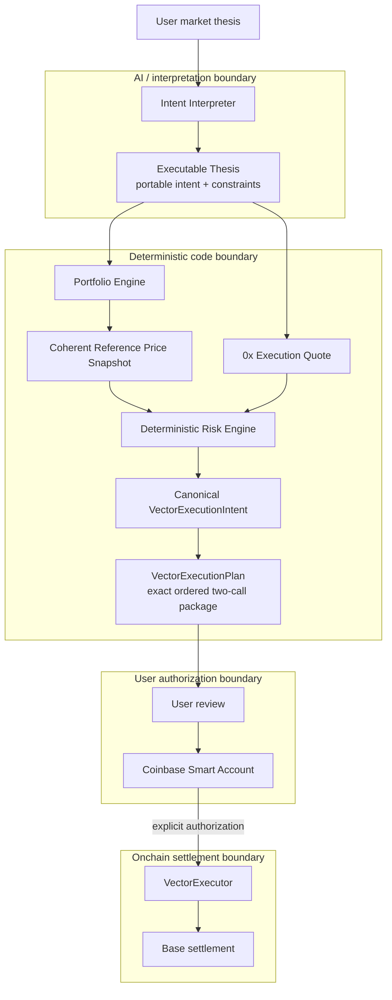
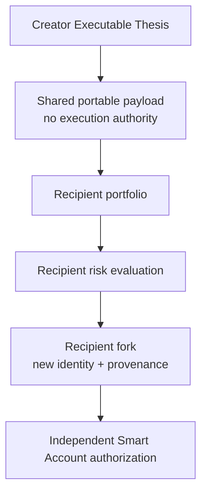

# Vector on Base

**Turn a market thesis into a portfolio-aware, risk-constrained position you can authorize on Base.**

Vector on Base is an intent execution layer for tokenized markets. Its core object is the
**Executable Thesis**: portable market intent plus reusable constraints, with execution authority
deliberately left out. AI interprets intent; deterministic code controls adaptation and execution;
the user controls authorization through a Coinbase Smart Account.

The product's social primitive is simple: **share the thesis, not the trade.** A recipient adapts
the same thesis to their own portfolio, reruns risk, optionally forks it, and authorizes their own
position.

## What works

| Capability                                  | Status                       |
| ------------------------------------------- | ---------------------------- |
| Coinbase Smart Account authentication       | **LIVE**                     |
| User-controlled Smart Account authorization | **PROVEN ON BASE SEPOLIA**   |
| VectorExecutor                              | **DEPLOYED ON BASE SEPOLIA** |
| Exact two-call approval and execution       | **PROVEN ON BASE SEPOLIA**   |
| Deterministic portfolio and risk engine     | **COMPLETE**                 |
| B20 amount handling and validation          | **COMPLETE**                 |
| Executable Thesis browser-local persistence | **COMPLETE**                 |
| Share / Adapt / Fork                        | **COMPLETE**                 |
| 0x BStocks production routing               | **ACCESS PENDING**           |
| Chainlink equity streams                    | **ACCESS PENDING**           |
| Base Mainnet VectorExecutor                 | **NOT DEPLOYED**             |

Demo execution is clearly isolated: **BASE SEPOLIA · TEST ASSETS · NO REAL STOCKS**.

## Run locally

Prerequisites: Node.js 24+, npm, and [Foundry](https://book.getfoundry.sh/getting-started/installation)
for the local contract E2E verifier.

```sh
npm install
cp .env.example .env
npm run dev --workspace apps/web
```

Set the browser-safe `NEXT_PUBLIC_CDP_PROJECT_ID` in `apps/web/.env.local`, then open
`http://localhost:3000`. Keep `ZEROX_API_KEY`, `CHAINLINK_DATA_STREAMS_API_KEY`, and
`CHAINLINK_DATA_STREAMS_USER_SECRET` server-only in the ignored root `.env`. Deployer/admin keys
must never be stored in the repository or environment files; deployment scripts use an encrypted
Foundry keystore. See [Base Sepolia setup](docs/BASE_SEPOLIA.md) for the optional live testnet demo.

## What Vector does

1. The user expresses a market thesis.
2. Vector structures it as an Executable Thesis.
3. Deterministic code adapts the requested position to that user's portfolio constraints.
4. The user reviews the risk result and exact execution package.
5. The user explicitly authorizes the two calls through a Coinbase Smart Account.
6. `VectorExecutor` enforces settlement constraints around the external execution route.

The current demo interpreter is a deterministic, NVDA-specific grammar; the architecture keeps
interpretation outside the authority and settlement boundaries so a production AI interpreter
cannot authorize or bypass execution checks.

## Executable Thesis

A normal signal says: **“Buy NVDA.”**

An Executable Thesis carries enough structured intent to be independently evaluated:

- asset and entry condition;
- requested position and maximum exposure;
- reserve requirement and slippage bound;
- expiry and application provenance.

It never carries wallet authorization, a nonce, quote, calldata, token allowance, portfolio
balance, or risk acceptance. Those values are private, time-sensitive, and user-specific.

> Same thesis. Different portfolio. Different executable position.

In the included demo, the creator requests **$500** and deterministic reserve logic adapts it to
**$320**. A recipient opens the same thesis against a different portfolio and receives an
independently computed **$180** position.

### Why this is not copy trading

Users share intent, not execution state. Recipient position sizing and risk are recomputed, the
recipient can be blocked even when the creator was accepted, and authorization is always
independent. A fork receives a new identity and application-level provenance; it does not inherit a
quote, risk decision, nonce, allowance, or signature.

## Architecture and trust boundaries



The reference snapshot values portfolio state and triggers; it is never replaced by a 0x execution
quote. Risk acceptance ends at `READY_FOR_AUTHORIZATION`. The Smart Account—not AI or a Vector
backend—is the transaction authority. `VectorExecutor` then enforces the owner, nonce, deadline,
asset/target/spender policy, sell bound, and minimum received amount onchain.

### Share / Adapt / Fork



## Base Sepolia execution proof

The confirmed testnet receipt proves a Coinbase user-controlled Smart Account submitted the exact
approval-then-execute batch, `VectorExecutor` settled through the deterministic fixture router, its
temporary router allowance returned to zero, and the recipient received `100,000,000` raw NOTB20
units. The receipt succeeded at Base Sepolia block `46,409,263`.

- VectorExecutor: [`0x6F6383…8b8EdE`](https://sepolia.basescan.org/address/0x6F638384B3d750F902CE74Fd98a8536C3D8b8EdE)
- UserOperation: `0x586d7c51d1768c18b4fe742d91a38eede645ed388bb43645c54d3a67a1eaa1cb`
- Transaction: [`0xb68a0b…175607d`](https://sepolia.basescan.org/tx/0xb68a0b23e4582471ce9a7a862a3e2db9aa41d0b7953d18ceb48427e0b717607d)

**BASE SEPOLIA · TEST ASSETS · NO REAL STOCKS.** This proves the authorization and settlement
path, not production stock liquidity. Full fixtures and evidence are in
[docs/BASE_SEPOLIA.md](docs/BASE_SEPOLIA.md).

## Production Mainnet path

The production code already includes canonical Base USDC; a verified Coinbase Tokenized Stocks
registry for `NVDAc`, `AAPLc`, `GOOGLc`, and `METAc`; B20 raw/economic amount conversion and live
validation; 0x Swap API v2 exact-sell integration; a versioned trusted AllowanceHolder policy;
target/spender and quote validation; a read-only mainnet readiness checker; and a Chainlink Data
Streams V11 reference-price adapter with coherent snapshot binding.

The remaining gates are explicit:

- **0x — ACCESS PENDING:** current production routing reports
  `BUY_TOKEN_NOT_AUTHORIZED_FOR_TRADE`; tokenized-equity access/legal entitlement is pending.
- **Chainlink — ACCESS PENDING:** server credentials and entitlement to the pinned equity streams
  are pending.
- **Base Mainnet — NOT DEPLOYED:** `VectorExecutor` is intentionally not deployed until the
  external production gates are resolved.

`npm run verify:mainnet-readiness` is read-only and reports these states without deploying,
signing, broadcasting, or submitting a UserOperation.

## Security model

- Vector never owns user signing keys; the Coinbase Smart Account is the transaction authority.
- The plan permits exactly two ordered calls and an exact executor approval—never an unlimited
  allowance.
- `VectorExecutor` enforces direct owner authorization, owner-scoped unordered nonces, and an
  inclusive deadline.
- Supported assets, execution targets, and allowance targets are independently allowlisted.
- Temporary executor allowances are cleared; 0x Settler never receives ERC-20 approval.
- Sell-token spend and recipient buy-token balance deltas are checked onchain.
- V1 has no automatic, relayed, delegated, or background execution.
- Risk is deterministic; AI cannot bypass policy or settlement constraints.
- Shared theses contain no wallet, quote, nonce, calldata, allowance, or risk-acceptance state.

See [docs/SECURITY.md](docs/SECURITY.md) for contract assumptions and administration risks.

## 60-second demo

The full judge runbook is [docs/DEMO.md](docs/DEMO.md). The condensed path is:

1. Enter the NVDA thesis.
2. Show the creator adjustment: **$500 → $320**.
3. Save and share the thesis.
4. Open it in the recipient context.
5. Adapt it to the recipient portfolio: **$180**.
6. Fork and inspect provenance.
7. Show the exact two-call authorization preview.
8. Show the confirmed Base Sepolia receipt.

## Verification

```sh
npm run typecheck
npm test
npm run lint
npm run format:check
npm run build --workspace apps/web
npm run verify:e2e
npm run verify:zerox
npm run verify:reference-prices
npm run verify:mainnet-readiness
```

The first six commands need no production credentials; `verify:e2e` runs only against a fresh local
Anvil chain. `verify:zerox` needs `ZEROX_API_KEY` plus `VECTOR_VERIFY_TAKER` and makes no trade.
`verify:reference-prices` needs both server-only Chainlink credentials.
`verify:mainnet-readiness` may require the 0x and Chainlink credentials plus a configured deployed
Mainnet executor; it is still strictly read-only. Access restrictions are reported as
**ACCESS PENDING**, not as broken functionality.

## Repository map

| Path                    | Responsibility                                                                                           |
| ----------------------- | -------------------------------------------------------------------------------------------------------- |
| `apps/web`              | Next.js demo, CDP authentication/authorization, thesis UI, local persistence, sharing, and Sepolia proof |
| `services/api`          | Read-only verification entry points for authorization, E2E, 0x, reference prices, risk, and readiness    |
| `services/watcher`      | Reserved service boundary; no watcher behavior is implemented in V1                                      |
| `packages/intent`       | Reserved production intent-interpreter package; current demo grammar lives in `apps/web`                 |
| `packages/portfolio`    | Typed balances, B20-aware valuation, portfolio snapshots, and reference-price interfaces                 |
| `packages/risk`         | Pure deterministic checks for balance, reserve, exposure, trigger, deadline, quote, and policy           |
| `packages/execution`    | Canonical execution intent, exact two-call plan, quote validation, and readiness classification          |
| `packages/b20`          | B20 address types and exact raw/economic amount conversion                                               |
| `packages/integrations` | Base registry/RPC, B20 verification, Coinbase boundary, Chainlink adapter, and 0x client/policy          |
| `contracts`             | Non-upgradeable `VectorExecutor`, Foundry tests, scripts, and isolated Sepolia fixtures                  |
| `docs`                  | Architecture, security, access-gate, demo, testnet, thesis, and submission evidence                      |

## Technical highlights

- Portable, machine-readable Executable Thesis with authority excluded by schema.
- Deterministic portfolio-specific adaptation of the same shared intent.
- Explicit separation of interpretation, deterministic validation, authorization, and settlement.
- B20 economic/raw amount handling that keeps valuation units out of swap calldata.
- Versioned trusted 0x AllowanceHolder policy with separate target and spender validation.
- User-controlled Coinbase Smart Account authorization with an exact two-call batch.
- Owner-scoped unordered execution nonces and reference-price snapshot binding.
- Application provenance for independent forks and confirmed live Sepolia settlement.

## Current scope and access gates

Base Mainnet execution is intentionally gated: no Mainnet executor is deployed, 0x BStocks access
is pending, and Chainlink equity-feed entitlement is pending. Persistence is browser-local,
provenance is application-level rather than onchain-attested, and Demo Mode uses isolated Sepolia
test assets. These are the current V1 scope and access boundaries.

Reusable submission copy and judge FAQ: [docs/SUBMISSION.md](docs/SUBMISSION.md).
