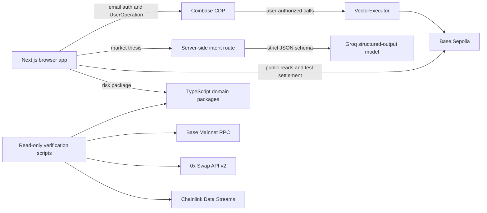

# Vector on Base

Vector on Base turns market theses into constrained token execution plans that users can authorize with Coinbase Smart Accounts on Base.

[](https://youtu.be/aNSPwnla2Ds)

[Watch the demo on YouTube](https://youtu.be/aNSPwnla2Ds)

## Table of contents

- [Overview](#overview)
- [Architecture](#architecture)
- [Prerequisites](#prerequisites)
- [Installation](#installation)
- [Configuration](#configuration)
- [Usage](#usage)
- [API reference](#api-reference)
- [Project structure](#project-structure)
- [Testing and demo](#testing-and-demo)
- [Deployment](#deployment)
- [Current limitations](#current-limitations)
- [Post-hackathon roadmap](#post-hackathon-roadmap)
- [Troubleshooting and FAQ](#troubleshooting-and-faq)
- [Contributing](#contributing)
- [License](#license)

## Overview

This repository is a hackathon MVP for expressing a market thesis, applying deterministic portfolio constraints, and preparing an exact two-call token execution. The browser demo uses NVDA as its current demonstration scenario, not as the limit of Vector's intended asset coverage. It uses Coinbase CDP email authentication and a user-controlled Smart Account on Base Sepolia. Production-oriented packages contain Base Mainnet asset, 0x, Chainlink, portfolio, risk, and execution-plan logic, but Base Mainnet execution is not deployed or enabled.

An Executable Thesis contains portable intent and constraints. It does not contain a wallet authorization, quote, nonce, calldata, allowance, risk acceptance, or receipt. Shared theses are adapted against the recipient's portfolio instead of copying the creator's execution state.

## Architecture



The main components are:

- `apps/web`: Next.js App Router UI. It calls a server-side Groq intent interpreter, then provides browser-local thesis storage, share links, Coinbase CDP authentication, a Base Sepolia faucet, and a fixed test swap. Its Smart Account UserOperations include Vector's ERC-8021 Builder Code attribution.
- `packages/shared`: chain and asset types plus the asset registry.
- `packages/b20`: B20 address validation and raw/economic amount conversion.
- `packages/portfolio`: portfolio snapshots and fixed-point reference valuation.
- `packages/risk`: deterministic validation of balance, reserve, exposure, trigger, deadline, quote, slippage, and policy constraints.
- `packages/integrations`: Base RPC and asset adapters, Coinbase Smart Account call conversion, 0x client and target policy, and Chainlink Data Streams readers.
- `packages/execution`: normalized quotes, provider-backed snapshots, canonical execution intents, two-call plans, and Base Mainnet readiness classification.
- `contracts`: the non-upgradeable `VectorExecutor`, Base Sepolia-only fixtures, deployment scripts, unit tests, fuzz tests, and invariants.
- `services/api`: command-line verification entry points. The only HTTP endpoint is the Next.js Groq interpretation route under `apps/web`.

The web demo and production-oriented command-line path are separate. The web demo uses fixed Base Sepolia fixture contracts and deterministic portfolio values. The production readiness command uses Base Mainnet reads, 0x, and Chainlink, but never signs or submits a transaction.

## Prerequisites

- Node.js `>=24`, as declared in the root `package.json`.
- npm with lockfile v3 support. The repository uses npm workspaces and `package-lock.json`; an exact npm version is not pinned.
- Foundry for `forge`, `cast`, and `anvil` when building or testing Solidity or running the local E2E verifier. An exact Foundry version is not pinned.
- Solidity `0.8.36` and Cancun EVM support, configured in `contracts/foundry.toml`. Foundry downloads the compiler when required.
- A modern browser with Web Crypto, Web Storage, and standard Base64 APIs for the web app.
- A Coinbase CDP project with email authentication and `http://localhost:3000` in its allowed origins for authenticated local use.
- Base Sepolia ETH in the user's Smart Account if the testnet transaction is not sponsored.

The external 0x and Chainlink credentials are needed only for their live, read-only verification commands. They are not needed for installation, unit tests, deterministic verification scripts, or the local Anvil E2E test.

## Installation

From a clean checkout:

```sh
git clone https://github.com/phllp-tanstic/vector-on-base.git
cd vector-on-base
npm ci
cd contracts
forge install OpenZeppelin/openzeppelin-contracts@v5.6.1 \
  foundry-rs/forge-std@v1.16.1 --no-git
cd ..
```

The Foundry dependency directories are intentionally ignored by Git, so the `forge install` step is required after a fresh clone before Solidity builds or `npm run verify:e2e`.

## Configuration

Copy the tracked server-side template when using the live verification commands:

```sh
cp .env.example .env
```

Only `verify:zerox`, `verify:reference-prices`, and `verify:mainnet-readiness` automatically load the root `.env`. Other commands read the current shell environment. Next.js loads browser-safe values from `apps/web/.env.local`.

### Browser variables

| Variable                                      | Required by           | Default or example                           | Description                                                                                                                         |
| --------------------------------------------- | --------------------- | -------------------------------------------- | ----------------------------------------------------------------------------------------------------------------------------------- |
| `NEXT_PUBLIC_CDP_PROJECT_ID`                  | Authenticated web app | `your-cdp-project-id`                        | Public CDP project identifier. Configure the browser origin in the CDP Portal.                                                      |
| `NEXT_PUBLIC_VECTOR_TEST_DEMO_FAUCET_ADDRESS` | Optional demo faucet  | `0x5c45ae224A1D2D4Aa850563c3F3fa9fB5B69aabF` | Currently configured public Base Sepolia faucet. The UI verifies bytecode and disables claims if the address is missing or invalid. |

Do not put CDP API secrets, Wallet Secrets, deployer keys, or server credentials in a `NEXT_PUBLIC_*` variable.

### AI interpreter variables

| Variable       | Required by                   | Default or example   | Description                                                                |
| -------------- | ----------------------------- | -------------------- | -------------------------------------------------------------------------- |
| `GROQ_API_KEY` | `/api/interpret`              | No default           | Server-side Groq API key. Never expose it through a `NEXT_PUBLIC_*` value. |
| `GROQ_MODEL`   | Optional interpreter override | `openai/gpt-oss-20b` | Groq model with strict Structured Outputs support.                         |

### Base Mainnet and provider variables

| Variable                             | Required by                                        | Default or example                           | Description                                                                                 |
| ------------------------------------ | -------------------------------------------------- | -------------------------------------------- | ------------------------------------------------------------------------------------------- |
| `BASE_RPC_URL`                       | Base read commands                                 | `https://mainnet.base.org`                   | Base Mainnet HTTP(S) RPC URL.                                                               |
| `ZEROX_API_KEY`                      | `verify:zerox`, mainnet readiness                  | No default                                   | Server-side 0x API key.                                                                     |
| `ZEROX_API_BASE_URL`                 | 0x client                                          | `https://api.0x.org`                         | Optional API base URL. HTTP is accepted only for loopback testing.                          |
| `CHAINLINK_DATA_STREAMS_API_KEY`     | Chainlink verification                             | No default                                   | Server-side Chainlink Data Streams API key.                                                 |
| `CHAINLINK_DATA_STREAMS_USER_SECRET` | Chainlink verification                             | No default                                   | Server-side Chainlink Data Streams user secret.                                             |
| `VECTOR_EXECUTOR_ADDRESS`            | Production plan creation and readiness             | `0x1111111111111111111111111111111111111111` | Base Mainnet `VectorExecutor` address. No production executor is currently deployed.        |
| `VECTOR_VERIFY_TAKER`                | `verify:zerox`                                     | `0x2222222222222222222222222222222222222222` | Non-zero taker address used for the non-submitting quote request.                           |
| `VECTOR_VERIFY_SELL_USDC`            | `verify:zerox`                                     | `1000000`                                    | Positive raw USDC amount. The default is 1 USDC.                                            |
| `VECTOR_VERIFY_ACCOUNT`              | `verify:portfolio`                                 | Zero address                                 | Optional account for Base balance reads. This command does not automatically load `.env`.   |
| `VECTOR_MAINNET_SMART_ACCOUNT`       | Reference-price portfolio projection and readiness | `0x2222222222222222222222222222222222222222` | Optional for preliminary reads, but required for an account-bound canonical `READY` result. |
| `VECTOR_MAINNET_SELL_USDC`           | Mainnet readiness                                  | `1000000`                                    | Positive raw USDC sell amount.                                                              |
| `VECTOR_MAINNET_STOCK_SYMBOL`        | Mainnet readiness                                  | `NVDAc`                                      | Must resolve to an enabled stock in the verified registry.                                  |
| `VECTOR_MAINNET_STOCK_TOKEN_ADDRESS` | Mainnet readiness                                  | Registry address for the selected symbol     | Optional address pin. It cannot introduce an unregistered asset.                            |

### Base Sepolia maintenance variables

| Variable                                    | Required by                                 | Default or example                           | Description                                                                                  |
| ------------------------------------------- | ------------------------------------------- | -------------------------------------------- | -------------------------------------------------------------------------------------------- |
| `BASE_SEPOLIA_RPC_URL`                      | Foundry deployment and maintenance commands | `https://sepolia.base.org`                   | Keep credential-bearing provider URLs server-side. Scripts receive this through `--rpc-url`. |
| `VECTOR_OWNER_ADDRESS`                      | `DeployVectorExecutor.s.sol`                | `0x3333333333333333333333333333333333333333` | Initial `VectorExecutor` owner.                                                              |
| `VECTOR_TEST_MOCK_USDC_ADDRESS`             | Configure, faucet deploy, and mint scripts  | `0x1e3AEfb7A9220a50ff2655f6d912cEa70993B3a9` | Base Sepolia-only mock USDC contract.                                                        |
| `VECTOR_TEST_MOCK_B20_LIKE_TOKEN_ADDRESS`   | Configure script                            | `0x7d8D51976eB74A7949116732521e48B08d0c92Fd` | Base Sepolia-only mock B20-like token.                                                       |
| `VECTOR_TEST_MOCK_EXECUTION_ROUTER_ADDRESS` | Configure script                            | `0x6Bb43afccc1fd9d8864Db2604A9b27117716EcAB` | Base Sepolia-only deterministic router.                                                      |
| `VECTOR_TEST_SMART_ACCOUNT`                 | Mint script                                 | User Smart Account address                   | Recipient of the maintenance mint.                                                           |
| `VECTOR_TEST_MOCK_USDC_MINT_AMOUNT`         | Mint script                                 | `10000000`                                   | Raw 6-decimal mock USDC units. The script rejects zero and values above `100000000`.         |

Deployment keys are not environment variables in this repository. Foundry scripts use an encrypted keystore account supplied with `--account`, and broadcasting requires an explicit `--broadcast` flag. See `docs/BASE_SEPOLIA.md` for the simulate-first procedure.

## Usage

### Minimal deterministic check

This command uses local fixtures and makes no network request:

```sh
npm run verify:risk
```

Expected output includes:

```text
Risk verification uses deterministic reference-price and 0x quote fixtures; not live prices.
SCENARIO_A_ACCEPTED_NVDA.status=ACCEPTED
SCENARIO_A_ACCEPTED_NVDA.nextState=READY_FOR_AUTHORIZATION
SCENARIO_B_RESERVE_REJECTION.rejections=RESERVE_VIOLATION
SCENARIO_C_EXPOSURE_REJECTION.rejections=EXPOSURE_LIMIT
authorizationPerformed=false
transactionSubmitted=false
```

### Run the web app

Create the web environment file, set `GROQ_API_KEY` and `NEXT_PUBLIC_CDP_PROJECT_ID`, and optionally set `NEXT_PUBLIC_VECTOR_TEST_DEMO_FAUCET_ADDRESS`:

```sh
cp apps/web/.env.example apps/web/.env.local
```

Then run:

```sh
npm run dev --workspace apps/web
```

Open `http://localhost:3000` for the landing page or `http://localhost:3000/app` for the application. Without a valid CDP project ID and allowed origin, the app renders a configuration error instead of enabling sign-in.

The implemented demo flow is:

1. Sign in by email OTP and use or create a Coinbase Smart Account.
2. Interpret the default NVDA thesis through the server-side Groq structured-output route.
3. Run the risk check. The fixture request is $500 and the creator portfolio reduces it to $320.
4. Save the thesis in browser local storage or copy its `/share?thesis=...` URL.
5. Open the shared route, sign in as a recipient, and adapt it. The recipient fixture reduces the request to $180.
6. Accept the risk result and prepare the fixed Base Sepolia execution preview.
7. Separately authorize the two-call UserOperation if the Smart Account has at least 1 mUSDC.

The testnet settlement always sells `1_000_000` raw mUSDC units and requires at least `100_000_000` raw NOTB20 units. It does not execute the displayed $320 or $180 portfolio amount.

### Run the local execution E2E check

This starts a temporary loopback Anvil chain, deploys local contracts, executes the bounded two-call plan through a test harness, and stops Anvil:

```sh
npm run verify:e2e
```

Expected output:

```text
Vector local execution E2E passed
network=anvil
authorizationMode=LOCAL_AUTHORIZATION_HARNESS
riskStatus=ACCEPTED
calls=2
sellAmount=100000000000000000000
minBuyAmount=110000000000000000000
actualBuyAmount=120000000000000000000
nonceConsumed=true
allowanceCleared=true
recipientReceived=true
executorResidualSell=0
executorResidualBuy=0
failureScenarios=RISK_REJECTED,WRONG_OWNER,EXPIRED,REUSED_NONCE,BELOW_MINIMUM,UNAPPROVED_ROUTER,WRONG_QUOTE_TOKEN,EXCESS_APPROVAL_PREVENTED
transactionSubmittedToBase=false
```

## API reference

### Web routes

| Route                       | Behavior                                                                                                   | Errors and constraints                                                                                                                                        |
| --------------------------- | ---------------------------------------------------------------------------------------------------------- | ------------------------------------------------------------------------------------------------------------------------------------------------------------- |
| `/`                         | Static landing page.                                                                                       | No authenticated functionality.                                                                                                                               |
| `/app`                      | CDP sign-in, Executable Thesis workflow, local persistence, Base Sepolia faucet, and fixed test execution. | Requires a valid public CDP project ID for sign-in. Transaction controls require a Smart Account.                                                             |
| `/share?thesis=<base64url>` | Decodes and displays a version 1 public thesis, then permits recipient adaptation after sign-in.           | Rejects empty, malformed, oversized, unknown-field, unsupported-schema, and unsupported-version payloads. The encoded payload is limited to 6,000 characters. |
| `POST /api/interpret`       | Sends an NVDA thesis to Groq from the server and returns schema-validated intent parameters.               | Requires `GROQ_API_KEY`; rejects oversized, malformed, unsupported-asset, rate-limited, provider-failed, and invalid-model responses.                         |

The interpretation route cannot authorize, quote, or submit a transaction. All risk and execution boundaries remain deterministic and separate.

Every Smart Account UserOperation constructed by Vector includes the Schema 0 ERC-8021 suffix for the registered Base Builder Code `bc_wm9pyn6y`. This applies to the Base Sepolia faucet and test execution requests as well as the Base Mainnet Smart Account submission boundary.

### TypeScript package entry points

All workspace packages are private and export TypeScript source directly. They are intended for this monorepo, not as published npm packages.

| Package                | Main entry points                                                                                                                                                    | Return or error behavior                                                                                                                                                                                          |
| ---------------------- | -------------------------------------------------------------------------------------------------------------------------------------------------------------------- | ----------------------------------------------------------------------------------------------------------------------------------------------------------------------------------------------------------------- |
| `@vector/shared`       | `parseVectorAsset`, `AssetRegistry`, `VECTOR_CHAIN_ID`, `VECTOR_BUILDER_CODE`, `VECTOR_BUILDER_DATA_SUFFIX`                                                          | Parses ERC-20/B20 assets, rejects invalid or duplicate registry entries with typed errors, and exposes Vector's canonical Schema 0 ERC-8021 attribution.                                                          |
| `@vector/b20`          | `getB20Variant`, `assertB20AssetAddress`, `rawToUIAmount`, `uiToRawAmount`                                                                                           | Uses branded `bigint` amounts and throws typed errors for invalid addresses, amounts, or multipliers.                                                                                                             |
| `@vector/portfolio`    | `createPortfolioSnapshot`, `createAssetPrice`, `valuePosition`, `valuePortfolio`, `valuePortfolioWithProvider`                                                       | Returns immutable snapshots and fixed-point values; throws `PortfolioDomainError` or `PortfolioValuationError` for invalid or incomplete inputs.                                                                  |
| `@vector/risk`         | `validateExecutionCandidate(candidate, registry)`                                                                                                                    | Returns `RiskValidationResult` with ordered checks and accumulated rejection codes. It does not authorize or submit.                                                                                              |
| `@vector/execution`    | `buildVectorExecutionIntent`, `buildVectorExecutionPlan`, `encodeVectorExecutionIntent`, `checkBaseMainnetExecutionReadiness`                                        | Builds a Base Mainnet-only intent and exact approval-plus-execute plan. Invalid risk, chain, asset, quote, target, amount, nonce, or deadline inputs throw typed validation errors or produce a non-ready report. |
| `@vector/integrations` | `createBasePublicClient`, `verifyB20Asset`, `createZeroXSwapClient`, `captureChainlinkReferencePriceSnapshot`, `buildSmartAccountCalls`, `sendSmartAccountExecution` | Encapsulates external reads and Smart Account conversion. `sendSmartAccountExecution` throws `SUBMISSION_DISABLED` unless `submissionEnabled: true` is explicitly supplied.                                       |
| `@vector/intent`       | `interpretMarketThesisWithGroq`, `parseInterpretedMarketThesis`, `MARKET_THESIS_JSON_SCHEMA`                                                                         | Calls Groq with strict Structured Outputs and validates bounded intent fields. It has no portfolio, quote, wallet, or transaction authority.                                                                      |

### VectorExecutor contract

`contracts/src/VectorExecutor.sol` exposes:

- `execute(ExecutionIntent)`: pulls at most `sellAmount`, calls an approved target with approved allowance semantics, clears allowance, verifies sell and buy deltas, refunds unused sell/native value, and returns the execution ID plus actual amounts.
- `cancelNonce(uint256)`: irreversibly consumes an unused nonce for the caller.
- `hashExecutionIntent(ExecutionIntent)`: returns the domain-separated hash for the current chain and executor address.
- Owner-only `setSupportedAsset`, `setExecutionTargetApproval`, and `setAllowanceTargetApproval` functions.
- Public getters for supported assets, approved targets, used owner nonces, and inherited two-step ownership state.

`execute` reverts for a wrong caller, unsupported or identical assets, unapproved targets, an expired or reused nonce, zero bounds, an invalid recipient, incorrect native value, a failed router call, excessive sell spend, or insufficient recipient output. See `docs/SECURITY.md` for the complete trust model.

## Project structure

```text
.
├── apps/web/                  # Next.js browser application and web-focused tests
├── contracts/
│   ├── script/                # Base Sepolia deploy, configure, faucet, and mint scripts
│   ├── src/                   # VectorExecutor and testnet-only fixture contracts
│   └── test/                  # Solidity unit, fuzz, fixture, and invariant tests
├── docs/                      # Architecture, security, demo, and deployment notes
├── packages/
│   ├── b20/                   # B20 identity and amount handling
│   ├── execution/             # Quotes, intents, plans, snapshots, and readiness
│   ├── integrations/          # Base, Coinbase, Chainlink, 0x, and executor config
│   ├── intent/                # Groq structured-output intent interpreter
│   ├── portfolio/             # Portfolio models and valuation
│   ├── risk/                  # Deterministic risk checks
│   └── shared/                # Shared chain and asset types
├── services/api/              # Executable verification scripts, not an HTTP server
├── .env.example               # Server and public environment template
├── package.json               # npm workspaces and root commands
└── package-lock.json          # npm lockfile v3
```

## Testing and demo

Run the JavaScript and TypeScript checks from the repository root:

```sh
npm run typecheck
npm test
npm run lint
npm run format:check
npm run build --workspace apps/web
```

Run Solidity tests from the Foundry project:

```sh
cd contracts
forge test
```

At the time this README was written, `npm test` passes 207 tests across 30 suites, and `forge test` passes 51 tests across four suites. The Solidity suite uses 256 fuzz runs and 128 invariant runs as configured in `contracts/foundry.toml`.

Coverage includes schema and asset validation, B20 conversion, fixed-point valuation, deterministic risk, 0x response validation and target policy, Chainlink report and snapshot validation, execution-plan encoding, Coinbase call boundaries, thesis persistence/sharing, browser action rendering, faucet rules, fixed test-swap preparation, Solidity settlement behavior, fuzzed boundaries, and contract invariants.

The automated tests do not exercise live email delivery, an actual CDP confirmation dialog, Vercel project settings, live 0x/Chainlink entitlement, or a Base Mainnet transaction. `npm run verify:zerox`, `npm run verify:reference-prices`, `npm run verify:portfolio`, `npm run verify:base`, and `npm run verify:mainnet-readiness` are separate read-only integration checks and may require network access or credentials.

The judge-oriented browser walkthrough is in `docs/DEMO.md`. Base Sepolia contract addresses, the faucet procedure, and the recorded successful receipt are in `docs/BASE_SEPOLIA.md`.

## Deployment

The current public web deployment is [https://vector-on-base.vercel.app](https://vector-on-base.vercel.app). The Vercel project is connected to the GitHub repository, uses `apps/web` as its application root, and deploys pushes to `main`. The repository has no `vercel.json`, Dockerfile, or version-controlled Vercel project metadata. GitHub Actions runs the repository checks independently of Vercel deployment.

Vercel must run the web workspace build:

```sh
npm run build --workspace apps/web
```

The production project needs `NEXT_PUBLIC_CDP_PROJECT_ID` and server-only `GROQ_API_KEY`. It needs `NEXT_PUBLIC_VECTOR_TEST_DEMO_FAUCET_ADDRESS` only when the public faucet should be enabled. The CDP project must allow the production origin.

The Vercel install command and platform Node.js selection are dashboard-managed rather than
version-controlled. They must remain compatible with the root npm workspace lockfile and the
`node >=24` requirement in `package.json`.

Solidity deployment is separate from web deployment. The existing browser demo pins already-deployed Base Sepolia fixture addresses. All Foundry scripts reject non-Sepolia chain ID `84532`, use an encrypted keystore selected with `--account`, and require `--broadcast` before changing chain state. Follow `docs/BASE_SEPOLIA.md`; do not deploy or reconfigure contracts as part of a normal web release.

## Current limitations

- The Groq AI interpreter is implemented, but the current browser and schema remain constrained to the NVDA hackathon scenario.
- Browser portfolio values and the $500 to $320 or $180 adaptations are labelled fixtures, not live account valuations.
- Base Sepolia execution uses mock mUSDC, a mock B20-like token, and a deterministic router. These assets have no monetary value and are excluded from the Base Mainnet registry.
- The fixed 1 mUSDC test settlement is independent of the displayed adapted dollar amount.
- Saved theses and confirmed receipts use origin-scoped browser `localStorage`. There is no hosted sync, account recovery, or cross-device library.
- Share URLs are public bearer data. Their fingerprint is a SHA-256 content identifier, not a signature or onchain attestation.
- Groq interpretation requires a separately managed API key and is subject to provider availability and rate limits. Broader multi-asset interpretation remains future work.
- The repository contains read-only Base Mainnet integration and readiness logic, but no production executor deployment and no Base Mainnet submission UI.
- 0x BStocks access and legal/account entitlement are pending. Known access restrictions are reported rather than bypassed.
- Production tokenized-stock access depends on provider, account, and jurisdiction eligibility. The
  Base Sepolia demo does not perform or imply an eligibility determination.
- Chainlink Data Streams credentials and subscription entitlement are pending.
- Custom CDP paymaster sponsorship, Spend Permissions, relaying, delegated execution, background execution, and automatic execution are not implemented.
- Beyond the bounded Groq interpretation route, no database, watcher, monitoring service, or production operations layer is implemented.

## Post-hackathon roadmap

Before a Base Mainnet deployment:

1. Obtain and verify 0x BStocks account and legal entitlement for the registered assets.
2. Obtain Chainlink Data Streams credentials and entitlement for the pinned equity feeds.
3. Wire provider-backed portfolio valuation and one coherent reference snapshot into the user-facing execution flow.
4. Complete quote freshness, minimum-output, simulation, and executor-funding checks without treating a 0x quote as an independent reference price.
5. Review and deploy `VectorExecutor` on Base Mainnet, configure supported assets and both target allowlists, and transfer ownership to an appropriate multisig or governance process.
6. Add production monitoring for executor ownership, allowlist changes, provider failures, quote failures, nonce use, and settlement events.
7. Add durable thesis storage only after defining authentication, privacy, retention, migration, and provenance rules.
8. Run an external security review and a user-controlled Smart Account mainnet rehearsal before enabling transaction submission.

`npm run verify:mainnet-readiness` must remain read-only. A `READY` result means the checked inputs can produce a canonical in-memory plan at that moment; it does not mean a user authorized, simulated, submitted, or mined a trade.

## Troubleshooting and FAQ

### Why does sign-in say the site configuration is invalid?

Confirm that `NEXT_PUBLIC_CDP_PROJECT_ID` is set in `apps/web/.env.local` and that the exact local or production origin is allowed in the CDP Portal. Restart or redeploy after changing a `NEXT_PUBLIC_*` value because it is embedded in the browser bundle.

### Why is local saving unavailable?

The MVP uses browser `localStorage`. Private browsing modes, storage policies, or disabled site storage can prevent persistence. The open thesis remains usable for the current page session, but it will not be stored.

### Why did copying a share link fail?

Clipboard access can be denied by browser policy. After a canonical URL is generated, the UI falls back to a temporary text selection and, if copying still fails, renders an `Open shared view` link. `Share link unavailable` instead indicates payload validation or URL generation failure.

### Why is a shared link rejected?

The `/share` decoder accepts only schema `vector.executable-thesis`, version `1`, the Base64URL alphabet, the exact public field set, and a payload no longer than 6,000 encoded characters. Truncated, edited, older, or unsupported links are rejected without importing state.

### Why does `npm run verify:e2e` fail before starting Anvil?

Confirm that `forge` and `anvil` are on `PATH`, then install the pinned Foundry libraries from the Installation section. The command builds Solidity artifacts before starting its temporary loopback chain.

### Why does mainnet readiness exit with status 1?

The command exits non-zero for every state other than `READY`. Missing executor deployment, credentials, provider snapshots, account context, asset support, target approval, balance, or 0x/Chainlink entitlement are expected classified failures. Read `state=`, `message=`, and each `check.<name>=` line instead of treating every non-zero exit as the same error.

### Why does `.env` not affect `verify:portfolio` or `verify:base`?

Those package scripts do not use Node's `--env-file-if-exists` flag. Export their variables in the current shell, or prefix the command with the required non-secret value. The three scripts that load `.env` are listed in the Configuration section.

## Contributing

The repository has no root `CONTRIBUTING.md`. The GitHub Actions workflow in `.github/workflows/ci.yml` runs the TypeScript quality suite and Solidity tests. Before opening a pull request:

1. Open an issue or describe the behavior, trust-boundary impact, and intended network scope in the pull request.
2. Keep Base Sepolia fixtures out of the Base Mainnet registry and keep secrets out of source, browser variables, logs, and test fixtures.
3. Add or update tests for behavior changes.
4. Run the TypeScript, test, lint, formatting, web build, and Solidity commands from the Testing section.
5. Document any new environment variable, external permission, contract deployment, or user-authorized side effect.

Changes to the 0x trusted contract manifest, asset registry, executor allowlists, authorization flow, or settlement invariants require explicit security review in the pull request.

## License

Vector on Base is licensed under the [MIT License](LICENSE).
